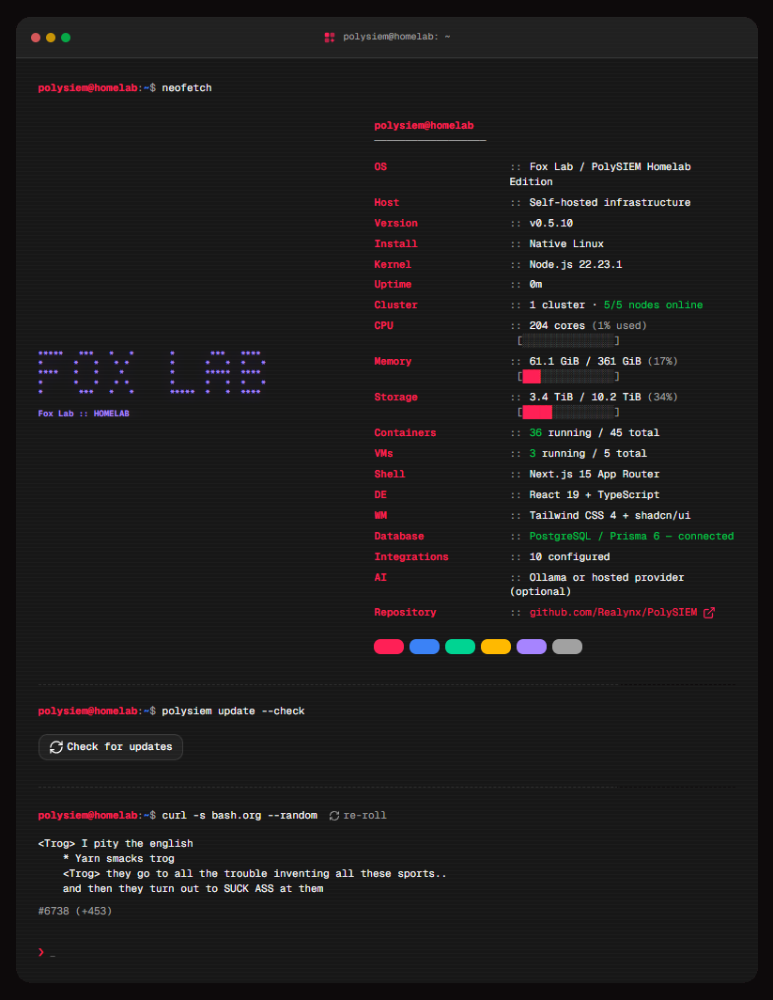

<p align="center">
  
</p>

<p align="center">
  Self-hosted inventory, network context, security visibility, and runbooks—kept in sync with your homelab.
</p>

<p align="center">
  <a href="https://github.com/Realynx/PolySIEM/actions/workflows/ci.yml"></a>
  <a href="https://github.com/Realynx/PolySIEM/actions/workflows/release.yml"></a>
  <a href="https://github.com/Realynx/PolySIEM/releases"></a>
  <a href="LICENSE"></a>
</p>

<p align="center">
  <a href="https://demo-polysiem.f0x.app/"><strong>Explore the live demo</strong></a> · Login: <code>demo</code> / <code>demo</code>
</p>

## About PolySIEM

If your homelab is anything like ours, the truth about it lives in a dozen places: the Proxmox UI, the firewall, a wiki that's six months stale, and your head. PolySIEM pulls that state into one place. It documents hosts, VMs, containers, services, networks, firewall policy, storage, and runbooks, and it remembers where each fact came from.

It connects to Proxmox, OPNsense, UniFi, Cloudflare, Tailscale, Elasticsearch, OTX, Censys, and SecurityTrails. Once things are wired up you can search and annotate the inventory (with audit history and network context stitched across integrations), dig through logs, investigate threats, build workflows, and expose scoped documentation through MCP. It runs entirely on your own infrastructure, with encrypted credentials, roles, and no default accounts.

<p align="center">
  
</p>

<p align="center">
  <sub>The in-app about page — a live <code>neofetch</code> for your lab.</sub>
</p>

## Security, AI, and Suricata

The security advisor scores your network exposure, firewall hygiene, access and identity, host hardening, and documentation coverage, then tells you what to fix first.

For AI, you can point PolySIEM at local Ollama or hosted OpenAI, DeepSeek, Anthropic, or Azure OpenAI. The assistant handles chat, documentation interviews, workflows, and security investigations, and provider credentials are encrypted at rest. Threat watch uses whichever provider you picked to review Elasticsearch log digests (Suricata alerts, Cloudflared activity, error spikes) and opens security tickets backed by the actual evidence.

On the intel side, PolySIEM pulls AlienVault OTX community threat intelligence, checks its IP indicators against your logs, and serves a generated IP/DNS ruleset that OPNsense Suricata can subscribe to.

See [Security and threat intelligence](docs/SECURITY.md) for setup, privacy boundaries, and the Suricata workflow.

## Install

Every installer does the same basic job: generate secrets, start PostgreSQL and PolySIEM, and wait for the health check. When setup finishes, open `http://<your-server>:3000` and create the first administrator account.

### Linux — Docker (recommended)

For Debian, Ubuntu, Fedora, and RHEL-family hosts:

```bash
curl -fsSL https://github.com/Realynx/PolySIEM/releases/latest/download/install.sh | bash
```

### Windows — Docker Desktop

Install and start Docker Desktop using Linux containers, then run in PowerShell:

```powershell
irm https://github.com/Realynx/PolySIEM/releases/latest/download/install.ps1 | iex
```

The installation is stored under `%LOCALAPPDATA%\PolySIEM`.

### Linux VM or LXC — Native

For a Debian or Ubuntu VM/LXC where you'd rather skip Docker:

```bash
curl -fsSL https://github.com/Realynx/PolySIEM/releases/latest/download/install-vm.sh | bash
```

This installs Node.js, PostgreSQL, and a checksum-verified prebuilt runtime with a hardened `polysiem.service` systemd unit. On architectures without a native bundle, it falls back to a source build.

If you want a dedicated immutable demo instance instead:

```bash
curl -fsSL https://github.com/Realynx/PolySIEM/releases/latest/download/install-vm.sh | bash -s -- --demo
```

Demo login credentials:

- **Username:** `demo`
- **Password:** `demo`

The demo flag auto-provisions the security-incident sample environment, locks persistent changes through the UI and API, and checks every 15 minutes for verified releases. Updates go through the native installer's database backup, health check, and automatic rollback. One caveat: demo mode only works on a fresh installation, so uninstall an existing normal instance first if you're sure its data can go.

To build from source instead of using the release bundle:

```bash
curl -fsSL https://github.com/Realynx/PolySIEM/releases/latest/download/install-vm.sh | bash -s -- --source
```

To force a repair/reinstall of the current release:

```bash
curl -fsSL https://github.com/Realynx/PolySIEM/releases/latest/download/install-vm.sh | bash -s -- --force
```

To uninstall PolySIEM, including its database, configuration, runtime, and backups:

```bash
curl -fsSL https://github.com/Realynx/PolySIEM/releases/latest/download/install-vm.sh | bash -s -- --uninstall
```

The uninstall leaves the shared Node.js and PostgreSQL OS packages installed.

### Manual Docker Compose or source build

```bash
mkdir -p /opt/polysiem && cd /opt/polysiem
curl -fL -o docker-compose.yml https://github.com/Realynx/PolySIEM/releases/latest/download/docker-compose.yml
# Create .env with DB_PASSWORD, DATABASE_URL, APP_SECRET, and APP_URL
docker compose up -d
```

The [installation guide](docs/INSTALL.md) has the complete `.env` example, plus source builds, upgrades, backups, migration, and troubleshooting.

## Documentation

<p align="center">
  <a href="docs/README.md"><strong>Docs hub</strong></a> ·
  <a href="docs/INSTALL.md">Installation</a> ·
  <a href="docs/CONFIGURATION.md">Configuration</a> ·
  <a href="docs/integration-setup.md">Integrations</a> ·
  <a href="docs/SECURITY.md">Security</a> ·
  <a href="docs/MCP.md">MCP</a> ·
  <a href="docs/DEVELOPMENT.md">Development</a>
</p>

<p align="center"><sub>Released under the <a href="LICENSE">MIT License</a>.</sub></p>
